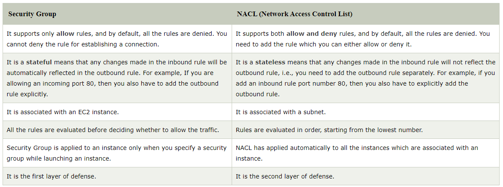
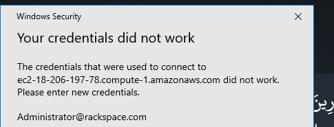
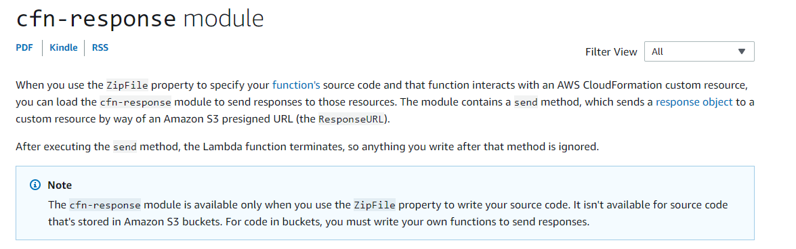

# Question I ask the seniors at work [Cloud Edition]
Questions I ask the seniors [mostly] at cloud


* **Q1**) Can I use GetAtt Param.parent ex: use `!GetAttr (!Ref MyChosenSubnet).Vpc` ?

  A1)

  **Q2**)  *diff bet NACL and Securty groups and add NACL*

  A2) NACL also adds an additional layer of security associated with subnets that control both inbound and outbound traffic at the subnet level.

  

  **Q3**)  *difference between s3 and s3api in aws CLI*

  A3) All commands in s3api can be done in s3 because s3 uses s3api

  **Q4**)  *difference between s3 and s3api in aws CLI*

  A4) All commands in s3api can be done in s3 because s3 uses s3api

  **Q5**) :red_circle: *Can't connect to Windows RDP for EC2 instance althought the credentials are right*
  

  **A5**) Use "Another Account" and put:

    * User name ( any of these ):
      ```
      .\Administrator
      localhost\Administrator
      127.0.0.1\Administrator
      public-ip\Administrator
      public-dns\Administrator
    ```

    * Password : `password decrypted from your key`


**Q6**)  *My CloudFormation stuck at update in progress when using custom resource*

  **A6**) I was using cfn-response package which is only available if the lambda is inline in the zipfile property but NOT IN A SEPRATE FILE uploaded to S3

  
# General Notes and Hints

- List all within the s3 bucket by using --recursive

# Good Resources

- https://www.javatpoint.com/aws-nacl-vs-security-group
- [A good article talking about best practices and tools to boost your CloudFormation experience](https://sanderknape.com/2018/08/two-years-with-cloudformation-lessons-learned/)
- [AWS: Error accessing the Internet with a custom Network ACL](https://serverfault.com/questions/821315/aws-error-accessing-the-internet-with-a-custom-network-acl)
